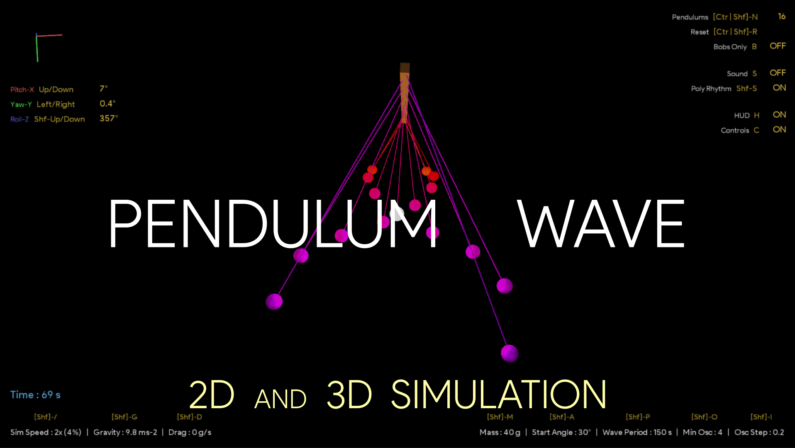
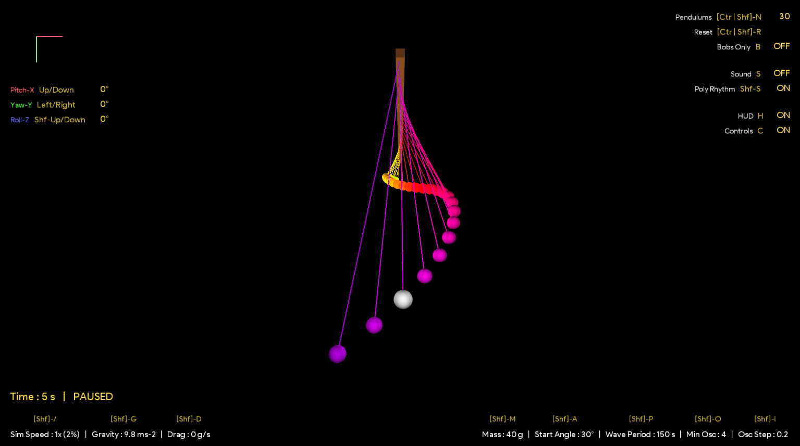
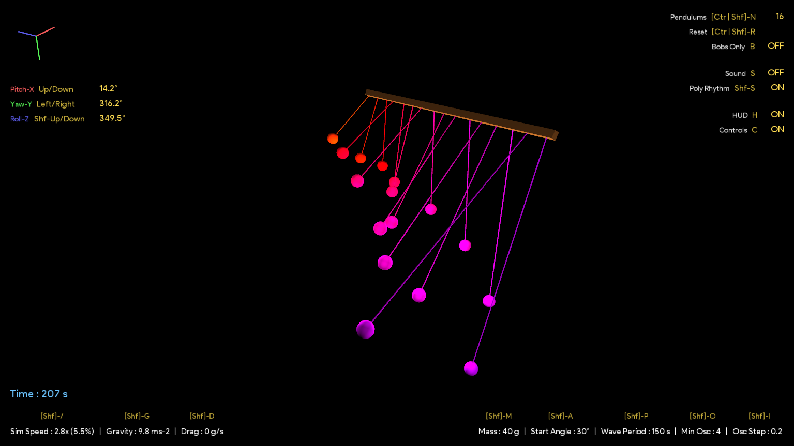
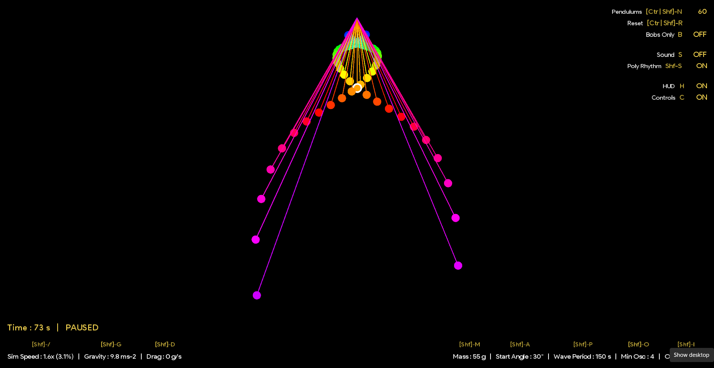
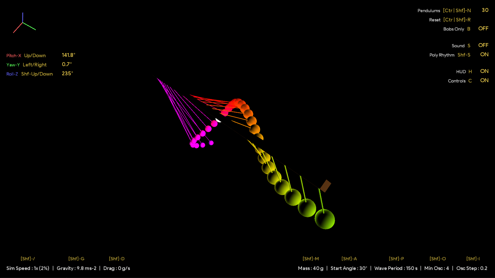
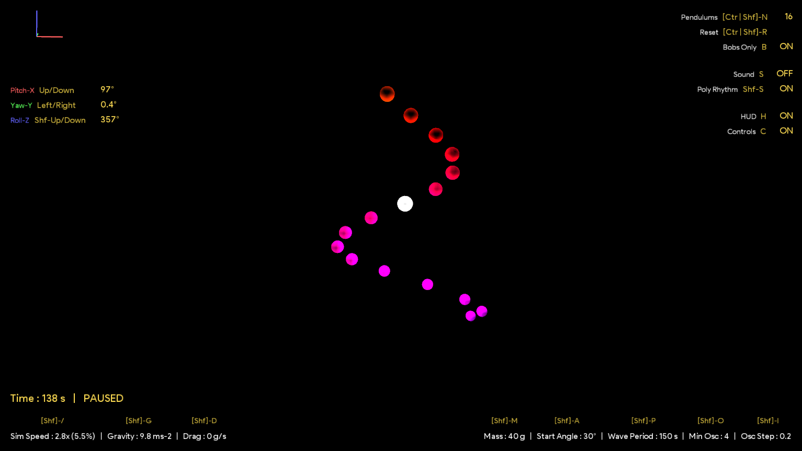
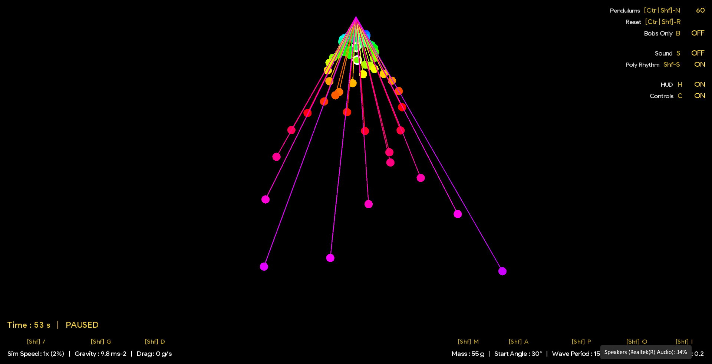
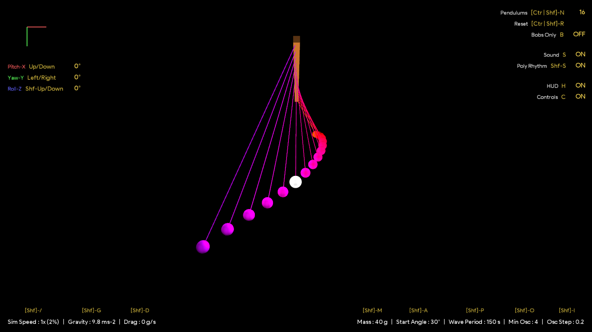

# Pendulum Wave Simulation

#### This is an interactive Pendulum Wave physics engine, with both 2D and 3D renderers and a real-time simulation environment with both graphical and command line control interfaces.

#### [View Playlist on YouTube](https://www.youtube.com/playlist?list=PL_oeaRvQxDbTU6Mm73ya1Dn9U1l9rreFx)

###### See also
[Fourier Series Simulation](https://github.com/ChauhanRohan-RC/Fourier-Series)  
[Fractal Simulation](https://github.com/ChauhanRohan-RC/Fractal)  
[3D N*N Rubik's Cube solver-AI](https://github.com/ChauhanRohan-RC/Cube.git)

## Mechanics
### Pendulum
* A bob with definite mass is attached to a chord of particular length. The bob exhibits damped harmonic motion when released from certain initial displacement.
* Equation of motion  
  `θ''(t) + (b/m * θ'(t)) + (g/L * sin(θ(t))) = 0`  
where  
`m` : mass of the pendulum bob, in kg  
`L` : length of the pendulum chord, in meter  
`g` : acceleration due to gravity, in m s-2  
`b` : drag coefficient, in kg s-1. Positive values corresponds to drag, negative to push  
`θ(t)`: angle the pendulum chord makes with the vertical axis as a function of time `t`  
`θ'(t)` : angular velocity, in rad s-1  
`θ''(t)` : angular acceleration, in rad s-2  
* This simulation integrates the above differential equation over minute time steps to describe `θ(t)` over time `t`.
* Time Period of a simple Pendulum is for small displacements is  
  `T = 2π sqrt(L/g)`
* Implementation: [Pendulum.java](src/pendulum/Pendulum.java), [PendulumDrawStyle.java](src/pendulum/PendulumDrawStyle.java) 

### Pendulum Wave
* A [Pendulum Wave](https://en.wikipedia.org/wiki/Pendulum_wave) comprises **a series of _uncoupled_ simple pendulums** with monotonically increasing lengths. As the pendulums oscillate, they appear to produce travelling and standing waves, beating, and random motion.
* **Classical case**: The lengths of the pendulums are set such that in a given time t, the first pendulum completes n oscillations, and each subsequent pendulum completes one more oscillation than the previous.  
  * **L(i) = g (t / 2π(n + i))2**  
    where  
    `L(i)`: Length of ith pendulum  
    `t`: `wave_period`, time in which the entire wave completes one cycle and all pendulums come in sync  
    `n`: `minimum_oscillations` in wave period i.e. of the first pendulum
* **General Case**: The increase in number of oscillations of successive pendulums (`oscillation_step`) need not be 1, and can be any floating point number. In this general case  
  * **L(i) = g (t / 2π(n + (i * osc_step)))2**  
    where  
    `L(i)`: Length of ith pendulum  
    `t`: `internal_wave_period`, time in which the entire wave would have completes one cycle if oscillation-step = 1  
    `n`: `minimum_oscillations` in wave period i.e. oscillations of the first pendulum in wave period time (floating point)  
    `osc_step` : `oscillation_step` per pendulum (floating point)  
  * `Effective Wave Period`: Time in which the pendulum wave would actually complete one cycle in cases where the oscillation step != 1 (general case).  
    `effective_wave_period = internal_wave_period / oscillation_step`
* When `oscillation_step = 1`, _General case converges to the Classical case_.
* Implementation: [PendulumWave.java](src/pendulum/PendulumWave.java)

## Usage
* Install [Java](https://www.oracle.com/in/java/technologies/downloads/) on your computer and add it to the path
* Clone this repository  
  `git clone https://github.com/ChauhanRohan-RC/PendulumWave.git`

#### 2D Simulation

* Navigate to [out/artifacts/PendulumWave2D_jar](out/artifacts/PendulumWave2D_jar)
* `Optional`: Checkout the configuration file [config-2D.ini](out/artifacts/PendulumWave2D_jar/config-2D.ini)
* Run [launch.bat](out/artifacts/PendulumWave2D_jar/launch.bat). 
* Optionally, open up the terminal and run `java -jar PendulumWave2D.jar`

#### 3D Simulation

* Navigate to [out/artifacts/PendulumWave3D_jar](out/artifacts/PendulumWave3D_jar)
* `Optional`: Checkout the configuration file [config-3D.ini](out/artifacts/PendulumWave3D_jar/config-3D.ini)
* Run [launch.bat](out/artifacts/PendulumWave3D_jar/launch.bat)
* Optionally, open up the terminal and run `java -jar PendulumWave3D.jar`

## Controls

#### Environment Controls
* `[Shift]-/` : Simulation Speed, in both multiples and percentage  (Continuous)
  * `/` : increase speed
  * `Shift-/` : decrease speed
* `[Shift]-G` : Acceleration due to Gravity (in ms-2)  (Continuous)
  * `G` : increase gravity
  * `Shift-G` : decrease gravity
* `[Shift]-D` : Drag Coefficient (in g/s), Positive value corresponds to drag, negative to push  (Continuous)
  * `D` : increase drag
  * `Shift-D` : decrease drag

#### Pendulum Controls
* `B` : Draw pendulum bobs only i.e. do not draw pendulum chords and support (Discrete)
* `[Shift]-M` : Mass of each pendulum Bob (in grams)  (Continuous)
  * `M` : increase Mass
  * `Shift-M` : decrease Mass
* `[Shift]-A` : Start angle for each pendulum (in degrees)  (Continuous)
  * `A` : increase start angle
  * `Shift-A` : decrease start angle

#### Pendulum Wave Controls
* `[Ctrl | Shift]-N` : Number of Pendulums in the Pendulum Wave (Discrete)
  * `N` : increase Count
  * `Shift-N` : decrease Count
  * `Ctrl-[Shift]-N` : change count without resetting pendulums state
* `[Shift]-P` : Wave Period i.e time in which the Pendulum Wave completes one cycle (in secs)  (Continuous)
  * `P` : increase wave period
  * `Shift-P` : decrease wave period
* `[Shift]-O` : Minimum Oscillations i.e. number of oscillations the first pendulum completes in wave period time  (Continuous)
  * `O` : increase min oscillations
  * `Shift-O` : decrease min oscillations
* `[Shift]-I` : Oscillation Step i.e. number of oscillations that a pendulum completes more than its predecessor  (Continuous)
  * `I` : increase oscillation step
  * `Shift-I` : decrease oscillation step

#### Simulation, Sound and Graphics Controls
* `Space` : Play/Pause simulation (Discrete)
* `Ctrl-S` : Save current graphics frame in a png file
* `[Ctrl | Shift]-R` : Reset the Simulation (Discrete)
  * `R` : reset Pendulums State
  * `Ctrl-R` : reset Pendulum Count
  * `Shift-R` : reset Simulation Environment
  * `Ctrl-Shift-R` : reset Everything

* `H` : Show/Hide HUD  (Discrete)
* `C` : Show/Hide Control Key Bindings  (Discrete)

* `S` : Toggle Sounds  (Discrete)
* `Shift-S` : Toggle Poly Rhythm i.e. play multiple notes at once  (Discrete)

#### Camera Controls
* `Up` | `Down` : Controls the Camera PITCH (rotation about X-Axis)  (Discrete)
* `Left` | `Right` : Controls the Camera YAW (rotation about Y-Axis)  (Discrete)
* `Shift-[Left | Right]` : Controls the Camera ROLL (rotation about Z-Axis)  (Discrete)

## Commands
* `help [-controls | -commands]` : Print usage information
  * Options
    * `-controls` : print controls information
    * `-commands` : print commands information

#### Pendulum Commands
* `mass [-reset] <value>` : Sets the mass of each pendulum (in grams). Must be > 0
* `angle [-reset] <value>` : Sets the start angle of each pendulum (in degrees)
* `bob-only` : Toggle draw bobs-only mode
  * Alias: `bobs`, `toggle bobs`, `toggle bobs-only`

#### Pendulum Wave Commands
* `count [-soft] <pendulum count>` : Sets the number of pendulums in the wave.
  * Alias: `num`, `n`
  * Options 
    * `-soft` : do not reset pendulums state

* `wp [-reset] <value>` : Sets the wave period (in secs). Must be > 0
  * Alias: `period`, `waveperiod`

* `minosc [-reset] <value>` : Sets the minimum oscillations in wave period. Must be > 0
  * Alias: `osc`, `mosc`

* `oscstep [-reset] <value>` : Sets the oscillation step per pendulum. Must be > 0
  * Alias: `step`, `ostep`

#### Environment Commands
* `speed [-x | -p] <value>` : Sets the simulation speed, in multipliers or percentage
  * Modes
    * `-x` : multiples or times (Default)
    * `-p` : percentage, in range `[0, 100]`

* `gravity [-reset] <value>` : Sets the acceleration due to gravity (in ms-2)
* `drag [-reset] <value>` : Sets the drag coefficient (in gram/s). positive value : drag, negative : push

#### Simulation, Sound, and Graphics Commands
* `play`, `pause`, `toggle-pause` : Play or pause the simulation
  * Alias: `start`, `stop` 
* `save` : Save current frame to a png file 
  * Alias: `snap`, `snapshot`, `saveframe`
* `reset [-state | -env | -count | -cam | -win | -all]` : Resets the given scope
  * Scopes
    * `-state` : reset pendulums state
    * `-env` : reset simulation environment
    * `-count` : reset pendulum count
    * `-cam` : reset camera (pitch, yaw and roll)
    * `-win` : reset window size and position
    * `-all` : reset everything  

* `sound` : Toggle sounds
* `poly-rhythm` : Toggle Poly Rhythm mode. If enabled, allows playing multiple notes at once

* `hud` : Toggle HUD overlay
* `keys` : Toggle control key bindings
  * Alias: `toggle keys`, `controls`, `toggle controls`
* `win [-size | -pos] <x> <y>` : Sets the window size or location on screen
  * Options
    * `-size` : set window size
    * `-pos` : set window location on screen

#### Camera Commands
* `pitch [-by | -f] <+ | - | value_in_deg>` : Sets the camera pitch (rotation about X-axis)
  * Alias: `rx`, `rotx`, `rotationx`
  * Wildcards: `+` or `up`, `-` or `down`
  * Options
    * `-by` : change current pitch by the given value
    * `-f` : force without animations

* `yaw [-by | -f] <+ | - | value_in_deg>` : Sets the camera yaw (rotation about Y-axis)
  * Alias: `ry`, `roty`, `rotationy`
  * Wildcards: `+` or `left`, `-` or `right`
  * Options
    * `-by` : change current yaw by the given value
    * `-f` : force without animations

* `roll [-by | -f] <+ | - | value_in_deg>` : Sets the camera roll (rotation about Z-axis)
  * Alias: `rz`, `rotz`, `rotationz`
  * Wildcards: `+` or `left`, `-` or `right`
  * Options
    * `-by` : change current roll by the given value
    * `-f` : force without animations

## Connect on
[Twitter](https://twitter.com/0rc_studio)  
[Youtube](https://www.youtube.com/channel/UCmyvutGWtyBRva_jrZfyORA)  
[Google Play Store](https://play.google.com/store/apps/dev?id=7315303590538030232)  
E-mail: com.production.rc@gmail.com

